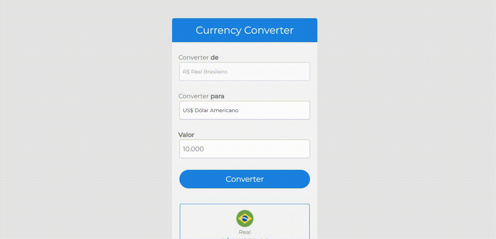

# Currency Converter

>  Conversor de moedas.

Confira a aplicação: https://devmatheus20.github.io/currency-converter/

## :page_facing_up: Explicação

O projeto trata-se de um conversor de moedas. Ele converte de real para 3 diferentes moedas, sendo elas: Dólar americano, Euro e Bitcoin.

<b>Como usar?</b>

Para utilizar, você precisa colocar um valor no input que está escrito "R$ 10.000,00". Depois só apertar no botão e ver o valor convertido.

Além disso, o projeto disponibiliza trocar o valor convertido em outras moedas. Para selecionar basta clicar no select e vai ter 3  opções de moedas e só escolher uma delas.

<b>Informações!</b>

O valor das moedas são fornecidos atráves do consumo de uma API.

As moedas estão formatadas de acordo como é em seu país.

## :dart: Etapas do Projeto ##

:heavy_check_mark: Estruturação da página com HTML;\
:heavy_check_mark: Estilização da página utilizando CSS;\
:heavy_check_mark: Aplicando o JavaScript;\
:heavy_check_mark: Chamar uma função ao clicar no botão;\
:heavy_check_mark: Converter o valor da moeda ao clicar no botão;\
:heavy_check_mark: Ao mudar a opção do Select a imagem e o nome da moeda mudam;\
:heavy_check_mark: Formatação da moeda com biblioteca interna do JavaScript (Intl.NumberFormat);\
:heavy_check_mark: Responsividade;\
:heavy_check_mark: Finalizado;

## :rocket: Tecnologias ##

Neste projeto foram utilizadas as seguintes ferramentas:

- [Html](https://developer.mozilla.org/pt-BR/docs/Web/HTML/Element/html/)  
- [CSS](https://developer.mozilla.org/pt-BR/docs/Web/CSS)  
- [JavaScript](https://developer.mozilla.org/pt-BR/docs/Web/JavaScript) 
- [Intl.NumberFormat](https://developer.mozilla.org/pt-BR/docs/Web/JavaScript/Reference/Global_Objects/Intl/NumberFormat) 

## 🤝 Colaboradores

Agradecemos à seguinte pessoa que contribuiu para este projeto:

<table>
  <tr>
    <td align="center">
      <a href="#">
         
        
          <b>Matheus Santos</b>
        
      </a>
    </td>
  </tr>
</table>

## 📝 Licença

Este projeto está sob licença. Consulte o arquivo [LICENSE](LICENSE.md) para obter mais detalhes.

&#xa0;

<a href="#top">Volte para o topo</a>